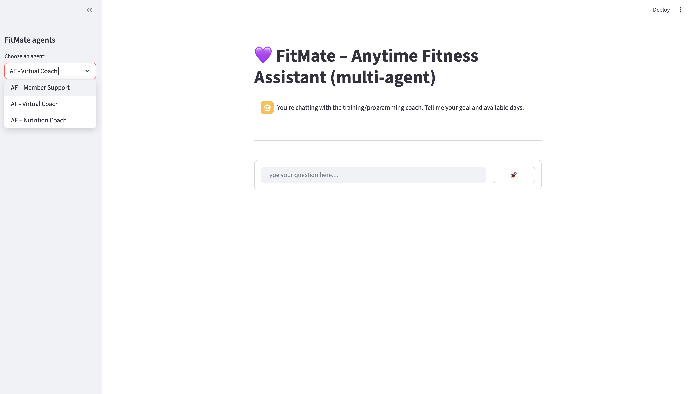
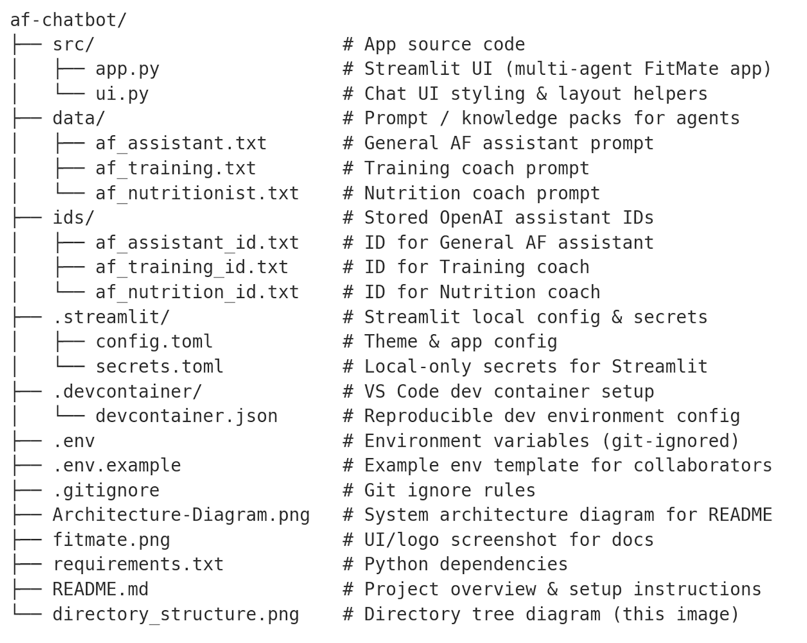

# 💜 FitMate – Anytime Fitness Chatbot

FitMate is a custom AI assistant for **Anytime Fitness Australia**, built with the OpenAI Assistants API and deployed via **Streamlit**. It answers common gym member queries, provides club contact details, and guides users with friendly, on-brand responses.

---

## 🚀 Features

- Real-time chat powered by OpenAI's Assistant API
- Integrated with Anytime Fitness FAQs and club data
- Vector store RAG for document-aware responses
- Beautiful, branded front-end using Streamlit + CSS
- Logs all interactions to CSV for future review

---

## 📸 Preview



---

## 🧰 Tech Stack

- [Python 3.9+](https://www.python.org/)
- [Streamlit](https://streamlit.io/)
- [OpenAI Assistants API](https://platform.openai.com/docs/assistants/overview)
- [Dotenv](https://pypi.org/project/python-dotenv/)

---

### 🛠️ Setup Instructions

1. Clone the repo  

```bash
git clone https://github.com/ben-clark-1999/af-chatbot.git
cd fitmate-chatbot
```

### 2. Create virtual environment 🐍

python3 -m venv .venv
source .venv/bin/activate
pip install -r requirements.txt

### 3. Install dependencies 📦

pip install -r requirements.txt

### 4. Set up `.env` ⚙️

OPENAI_API_KEY=your-openai-api-key-here

🔐 Do not commit this file to GitHub. Add .env to .gitignore.

### 5. Run the app  🚀

streamlit run src/app.py

Then open your browser to http://localhost:8501

## 💬 Sample Questions

Try asking:

- "When are staffed hours at Dee Why?"
- "How do I update my billing details?"
- "Can I bring a friend to the gym?"
- "Where’s the closest Anytime Fitness to Hunters Hill?"

## 📁 Directory Structure



---
## 🪪 License

MIT – free to use, modify and distribute.

---

© 2025 [Benjamin Clark](https://www.linkedin.com/in/benjamin-michael-clark/)
