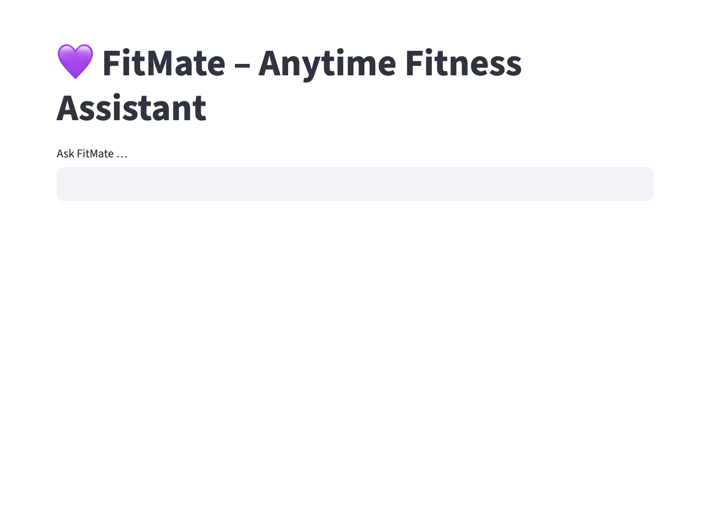
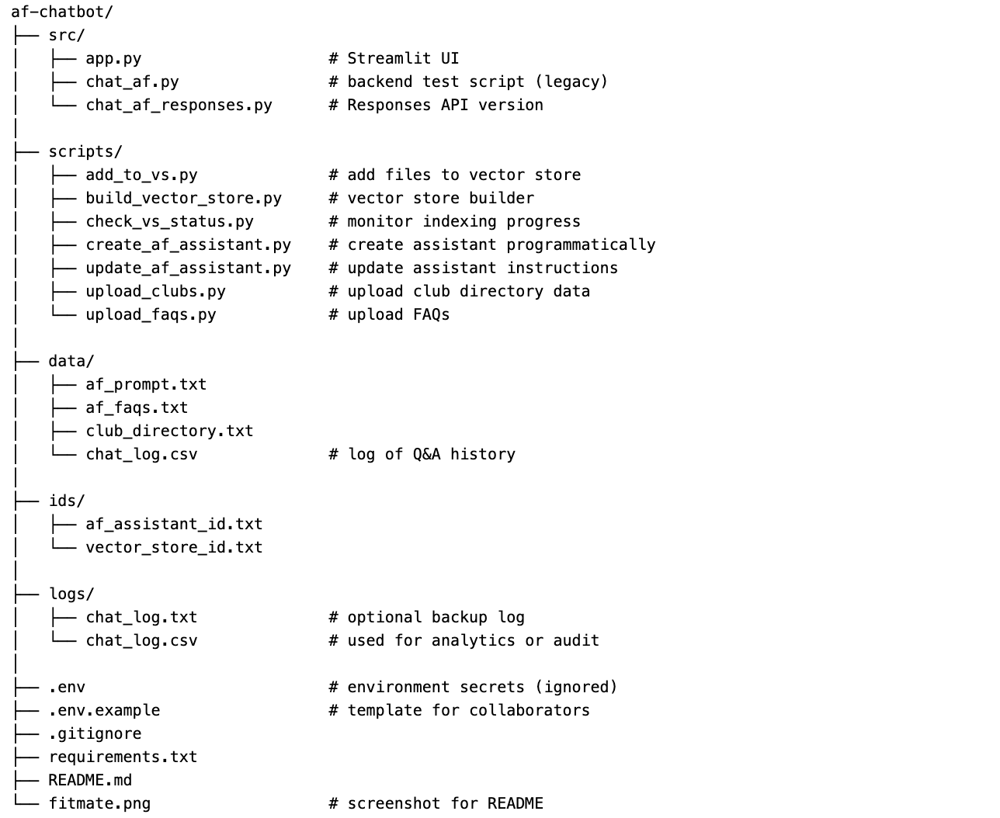

# 💜 FitMate – Anytime Fitness Chatbot

FitMate is a multi-agent AI assistant for **Anytime Fitness Australia**, built with the **OpenAI Assistants API** and **Streamlit**.

It helps members with:

- Day-to-day **club & membership questions**
- Personalised **training programs**
- High-level **nutrition guidance**

All with friendly, on-brand responses.

---

## 🧠 How does it work?

FitMate uses **three specialised OpenAI Assistants**, each with its own system prompt and knowledge pack:

- **AF – Member Support**  
  Handles locations, staffed hours, access, basic membership / billing questions, etc.

- **AF – Virtual Coach**  
  Designs structured training programs based on the user’s goal (lose fat, build muscle, get stronger, improve conditioning).

- **AF – Nutrition Coach**  
  Provides high-level nutrition guidance (fat loss, maintenance/leaning out, muscle gain) using simple, gym-goer-friendly language.

Each assistant uses OpenAI’s **file search / retrieval** over uploaded Anytime Fitness documents (e.g. FAQs, club info, training docs, nutrition notes), so answers stay grounded in real club information instead of hallucinating.

On top of that, FitMate applies light **post-processing** to training outputs to:

- Normalise headings like `Day 1 — Upper`, `Day 2 — Lower`
- Clean up bullet points and exercise lists
- Ensure there is always a short **“Tips for success”** section

---

## 🏗️ Architecture

The high-level architecture looks like this:


## 🚀 Features

- 🧑‍🤝‍🧑 **Multi-agent design**  
  Switch between **Member Support**, **Virtual Coach**, and **Nutrition Coach** from the sidebar.

- 🎯 **Goal-aware conversations**  
  Optional goal dropdown (e.g. *Lose fat*, *Build muscle*, *Gain muscle*) to prime the Training/Nutrition agents.

- 📚 **Document-aware responses**  
  Assistants are connected to Anytime Fitness FAQs / doc packs via OpenAI file search, so answers stay club-specific.

- 💬 **Streamlit chat UI**  
  Modern chat interface using `st.chat_message`, with custom CSS for a more polished, branded feel.

- 🧾 **Conversation logging**  
  All chats are logged to `logs/chat_log.csv` for later review and improvement.

---

## 📸 Preview



---

## 🧰 Tech Stack

- [Python 3.9+](https://www.python.org/)
- [Streamlit](https://streamlit.io/)
- [OpenAI Assistants API](https://platform.openai.com/docs/assistants/overview)
- [python-dotenv](https://pypi.org/project/python-dotenv/)

---

### 🛠️ Setup Instructions

1. Clone the repo  

```bash
git clone https://github.com/ben-clark-1999/af-chatbot.git
cd fitmate-chatbot
```

### 2. Create virtual environment 🐍

python3 -m venv .venv
source .venv/bin/activate
pip install -r requirements.txt

### 3. Install dependencies 📦

pip install -r requirements.txt

### 4. Set up `.env` ⚙️

OPENAI_API_KEY=your-openai-api-key-here

🔐 Do not commit this file to GitHub. Add .env to .gitignore.

You’ll also need to create three OpenAI Assistants in the dashboard and save their IDs into:

- ids/af_assistant_id.txt – Member Support

- ids/af_training_id.txt – Virtual Coach

- ids/af_nutrition_id.txt – Nutrition Coach

Each assistant should be configured with the appropriate system prompt + files/tools.

### 5. Run the app  🚀

streamlit run src/app.py

Then open your browser to http://localhost:8501

## 💬 Sample Questions

Try things like:

Member Support

- “When are staffed hours at Dee Why?”
- “How do I update my billing details?”
- “Can I bring a friend to the gym?”
- “Where’s the closest Anytime Fitness to Hunters Hill?”

Virtual Coach

- “I want a 4-day upper/lower split to build muscle.”
- “Write a 3-day full-body plan for a beginner who sits at a desk all day.”

Nutrition Coach

- “Help me lose fat while keeping muscle, I currently eat 2–3 times per day.”
- “Roughly how much protein should I aim for at 75kg?”

## 📁 Directory Structure



---
## 🪪 License

MIT – free to use, modify and distribute.

---

© 2025 [Benjamin Clark](https://www.linkedin.com/in/benjamin-michael-clark/)
